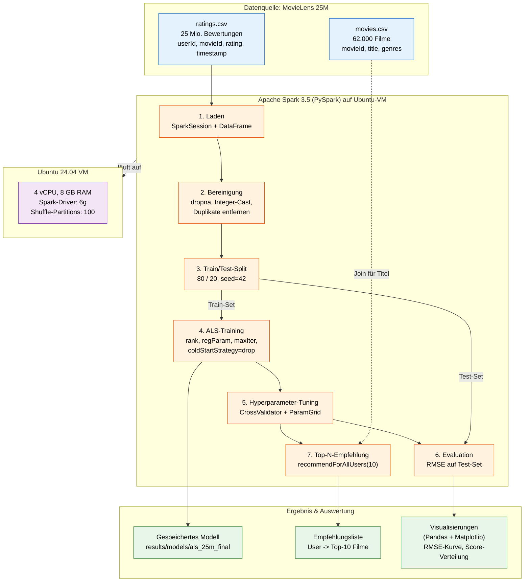

# Architektur des Empfehlungssystems

Das Diagramm zeigt den Datenfluss von der Rohdatenquelle (MovieLens 25M) über die Spark-Pipeline bis zu den finalen Top-N-Empfehlungen und Visualisierungen.

## Architektur-Diagramm (Mermaid)



## Komponentenbeschreibung

| Komponente | Verantwortung | Code/Artefakt |
|---|---|---|
| **Datenquelle** | Eingabe-CSVs (Ratings + Filme) | `data/ml-25m/` |
| **Laden** | CSV → Spark-DataFrame | `src/pipeline.py` |
| **Bereinigung** | Null-Werte droppen, Cast nach Integer, Duplikate raus | `src/pipeline.py` |
| **Train/Test-Split** | 80/20 mit festem Seed (Reproduzierbarkeit) | `src/pipeline.py` |
| **ALS-Training** | Matrix-Faktorisierung (Spark MLlib) | `notebooks/03_als_baseline.ipynb` |
| **Tuning** | CrossValidator über Parameter-Grid (rank, regParam) | `notebooks/04_tuning.ipynb` |
| **Evaluation** | RMSE auf Test-Set | `notebooks/03_als_baseline.ipynb` |
| **Top-N-Empfehlung** | `recommendForAllUsers(10)` + Join mit `movies.csv` | `notebooks/05_recommendations.ipynb` |
| **Modell speichern** | Persistiertes ALS-Modell für Demo | `results/models/als_25m_final/` |
| **Visualisierung** | Pandas + Matplotlib | `results/figures/` |

## Datenfluss in einem Satz

`ratings.csv` (25 Mio.) wird in Spark eingelesen, bereinigt, in Train/Test gesplittet; das ALS-Modell wird auf dem Train-Set trainiert (mit Cross-Validation getunet), auf dem Test-Set per RMSE evaluiert, und liefert schließlich Top-10-Filmempfehlungen pro User — gejoint mit `movies.csv` für lesbare Titel.

---

## Export als PNG (für die Doku)

**Option A — Online (am einfachsten):**
1. Mermaid-Code oben kopieren
2. Auf https://mermaid.live einfügen
3. Rechts oben "Actions" → "PNG" oder "SVG" herunterladen
4. Speichern als `results/figures/architektur.png`

**Option B — Lokal per CLI:**
```bash
npm install -g @mermaid-js/mermaid-cli
mmdc -i docs/architektur.md -o results/figures/architektur.png -w 1600
```

**Option C — VS Code:** Extension "Markdown Preview Mermaid Support" installieren, dann Preview öffnen und Screenshot machen.
